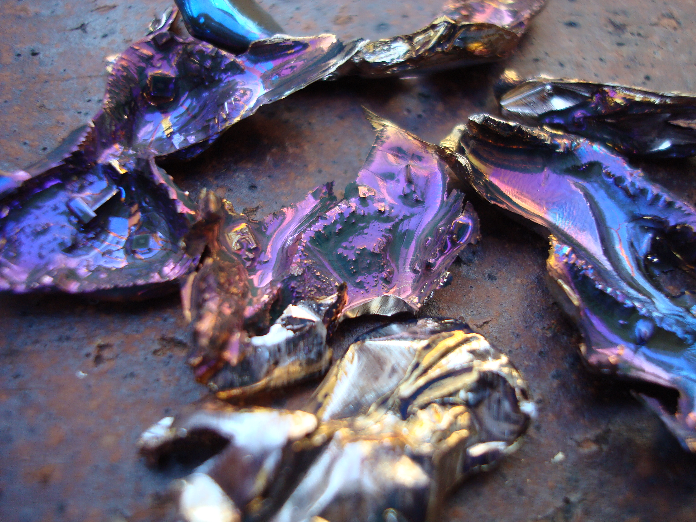
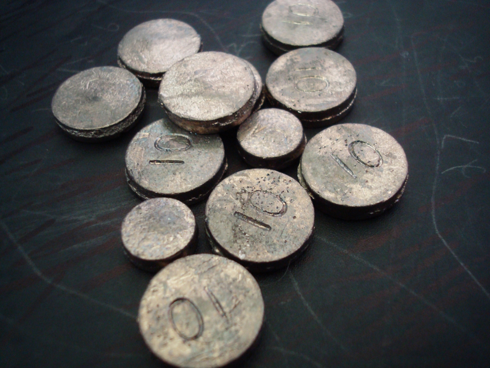
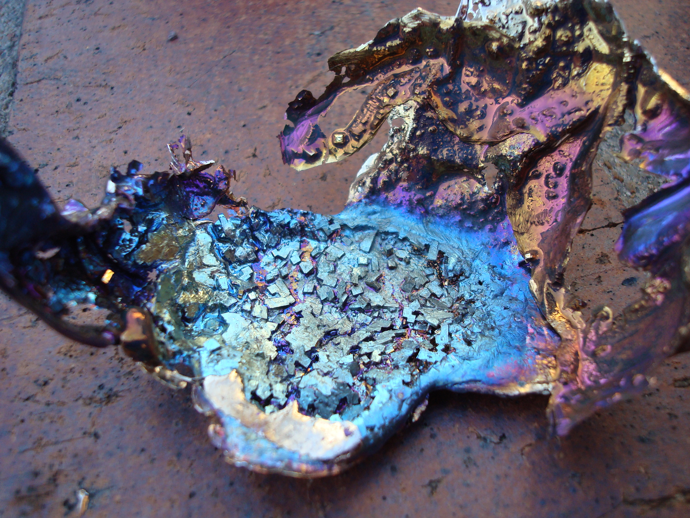
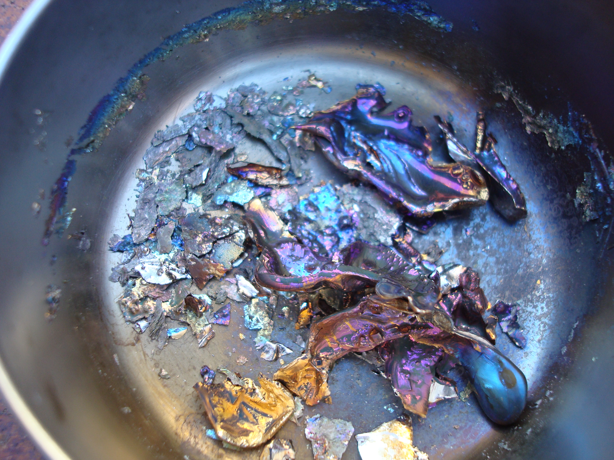
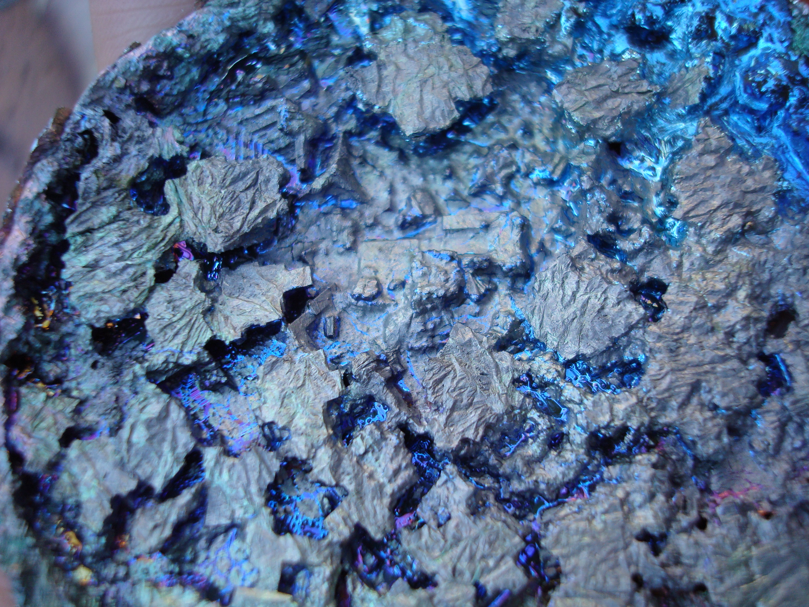

We made bismuth oxide crystals, following [a tutorial](https://www.popsci.com/diy/article/2004-11/grow-crystals-cup/).

 

The bismuth melts at a very low temperature, and so a steel pot and butane burner are all that we needed to get started. We checked to see how much of the bismuth had re-solidified by blowing on the surface---we avoided shaking the pot, as this can disrupt the formation of larger cubic crystals. Once half or so of the pot has congealed, I poured off the remaining liquid bismuth to reveal the crystal structures. The bismuth oxide layer forms almost instantly upon cooling.

 
 
 
 

