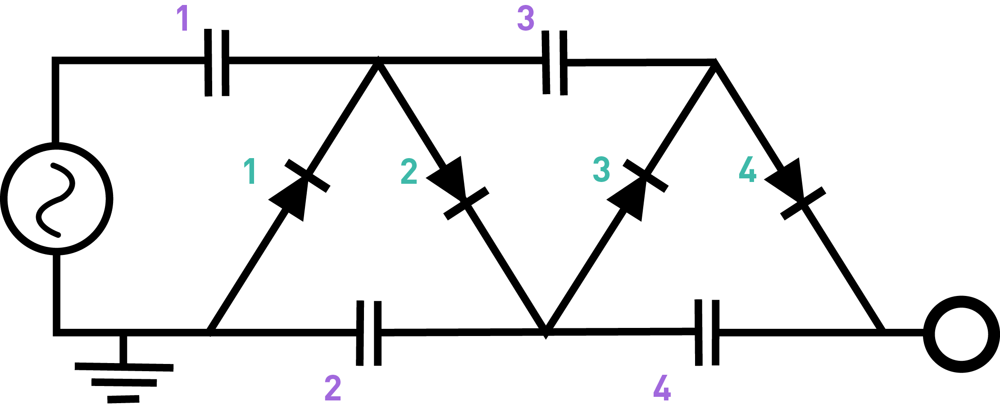

# Building a high power voltage multiplier

A few years ago I made a Cockroft-Walton voltage multiplier. The nice thing about this project is that it can be created entirely using cheap, store-bought components---diodes and capacitors---and so it is thus relatively easy to ensure that it will work and perform at the voltage estimated. I got my components from West Florida Components, and the total cost of everything was under $10. Video [here](https://www.youtube.com/watch?v=7zbK2kPf3zg).

The total voltage drop across many capacitors in series is equal to the sum of the voltage drop across each component---a consequence of Kirchoff's circuit laws. This can be mentally visualized as a charge on one end of a capacitor displacing and equal but opposite charge on the opposite plate, which in turn displaces an opposite charge on any other capacitor plates to which it connects, and so on. The Cockroft-Walton multiplier can be visualized as a fancy way of putting a bunch of capacitors in series and charging them so that they each have a voltage drop of 120V, resulting in a total discharge voltage of 120 V times the number of capacitors. This output is roughly DC, and it has a much lower current than the device draws from the mains, hence preserving energy conservation (since power equals voltage times current). A simple diagram of the half-wave CW multiplier looks like this:

 

The manner by which the CW multiplier can charge each capacitor separately to 120V is essentially by charging them in parallel and discharging them in series. The concept borrows from the design of a basic half-wave rectifier, which uses a diode and smoothing capacitor to convert the positive portions of AC sine waves to a smooth-ish DC current. The idea is that the first stage in the circuit (capacitor 1 and diode 1) converts the AC to an approximately constant DC signal, which then gets fed forward through diode 2 to the right plate of capacitor 2. During the first positive cycle, that capacitor charges to +120V. During the "off" cycle (the negative portion of the AC sine wave gets blocked by the first diode), the second capacitor discharges through diode 3 into capacitor 3 because, during the off cycle, there's now -120V on the bottom plate of that capacitor, leading to a potential difference that allows charging. During the next "on" cycle, the current ignores capacitor 3 because it is fully charged (and so it essentially acts like a break in the circuit there), and so now capacitor 4 gets charged instead. During the next off cycle, capacitor 4 discharges through diode 4 to charge capacitor 5, and the cycle repeats itself until, after `(number of capacitors) x (charging time)` all the capacitors are charged.

There are several equivalent ways of visualizing what is going on in the CW circuit, but the key things to remember are that the capacitors store the charge (differential) and the diodes force the AC to feed forward and charge each capacitor in sequence. The charging time can be adjusted by adjusting the time constants for each capacitor in the circuit relative to the AC cycle frequency (60 Hz in the US).

The device would build up charge twice as quickly if one instead uses a full-wave design (which is analogous to a full-wave bridge rectifier), because it would then take advantage of the negative swing of the AC sine wave, which gets lopped off by the first diode in the half-wave version.

Since this device runs off of mains power, I added a switch and fuse for safety reasons. The 1 mm spark regularly produced by the device is visible to the naked eye, and it can be used to drive continuously an 8 inch fluorescent tube. Curiously, the frequency of the pulses through the fluorescence in the tube depends on the proximity of other conducting objects---holding a pair of pliers near the bulb actually decreases the visible discharge rate. My best guess for the cause of this effect is that charge build sup on the glass interior beneath the metal. The device can also be discharged through a 1 inch xenon flash tube (such as one salvaged from a disposable camera).

Cockroft-Walton generators have a special historical significance because they were used to generate steering currents in one of the earliest particle accelerators. For this reason, one of the first large-scale CW multipliers (manufactured by Philips Co.) is prominently displayed in the National Science Museum in London:

 