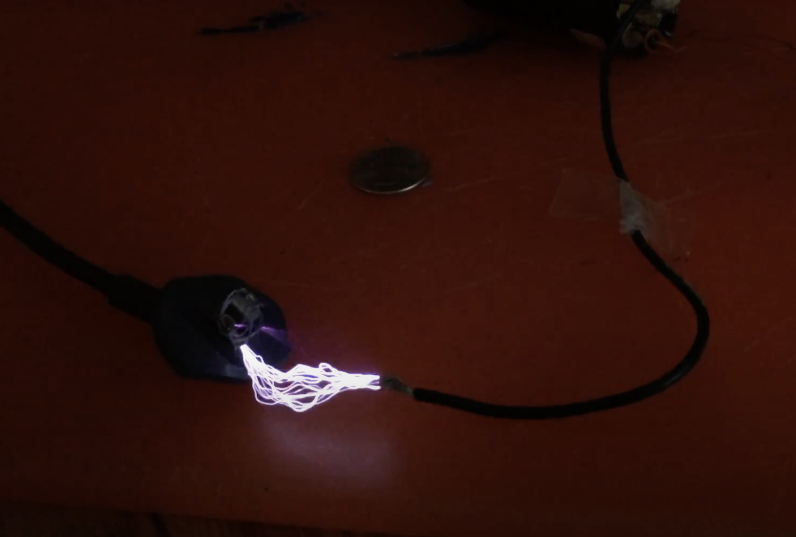

For an outreach event, we wanted to create a robust spark generator. There's a very nice [Instructables tutorial](http://www.instructables.com/id/MAKE-A-HIGH-VOLTAGE-SUPPLY-IN-5-MINUTES/) that shows how to use the rectifier from a  CFL light bulb to drive the transformer from an old television set. This produces a reliable stream of two-inch sparks:

 

<!-- See [video](https://www.youtube.com/watch?v=LlE3lYXfNMo) -->

The concept here is pretty simple. The circuit board at the base of a CFL bulb serves to transform mains power to a high-frequency, high voltage signal that illuminates the argon/mercury vapor inside the fluorescent envelope. If this signal is instead routed to the terminals of the primary circuit of a large step-up transformer, a high-frequency and even higher-voltage can be attained (at the expense of a lower current). For this demo, I salvaged the transformer from an old CRT-type television set. These types of sets operated by using electromagnets to steer a beam of electrons towards a phosphor coating on the screen, in order to create a continuously-updating image via rapid raster scans.