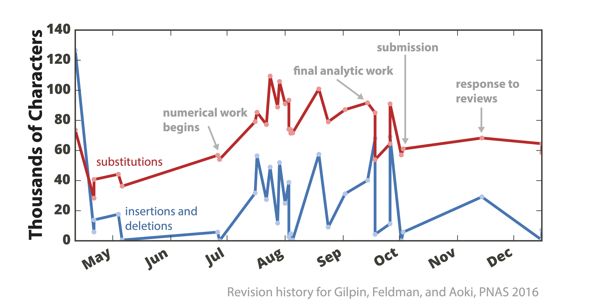
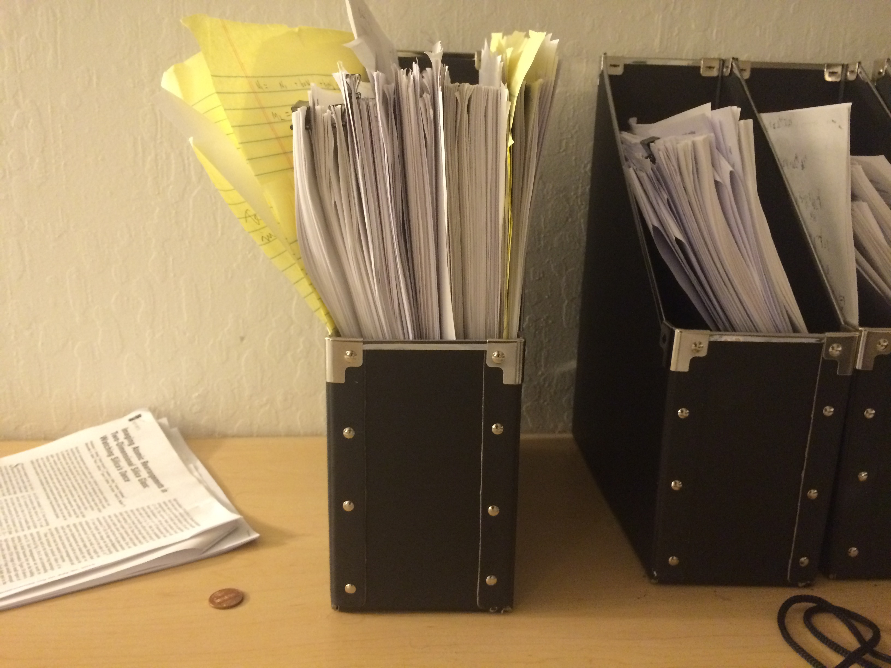
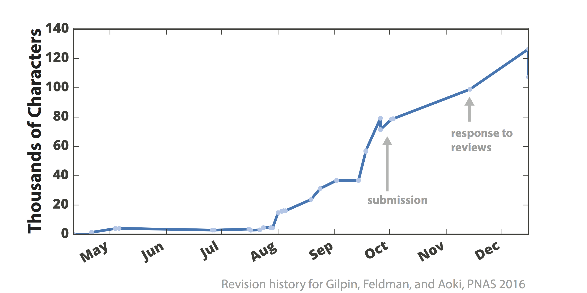

We [published a paper](https://www.pnas.org/content/113/8/2134) on the nonlinear dynamics of Neanderthal extinction in this month’s PNAS. Once we started writing the manuscript, I started keeping all of the files under version control. After we had finished the paper, I went on GitHub and downloaded the TeX source files for each version of the manuscript. I used Python’s difflib on a directory of the `.tex` files, to track the changes in the paper from one iteration to the next. 

 

The graph shows changes that brought the manuscript closer to the final manuscript version, with some of the major events labelled. You can see that, while the reviews caused us to rewrite many portions of the final paper (about 40% of all of the characters in the file were touched), these edits were concentrated in two bursts: the edits to get the paper accepted, and then an equal number of edits in the proofs stage (the last data point). A slightly more analog version of this data set looks like this:

 

Another interesting question might be the degree to which revisions altered the text, replaced the text, or reverted previous changes. The graph below shows changes in the number of characters from each revision to the next (this is sort of like taking the time derivative of the graph above). By comparing the red and blue curves, it can be seen that most long-term oscillations involved us adding and removing entire sections to the manuscript, but shorter term oscillations (like the zig-zags in July) can be attributed to us adding and then removing the same set of text.

 

The code I used to parse the file names, analyze the LaTeX source files, and extract the dates is [here on GitHub](https://github.com/williamgilpin/codebits/blob/master/miscellany/manuscript_history.ipynb). I added axes labels and annotations using Adobe Illustrator.
