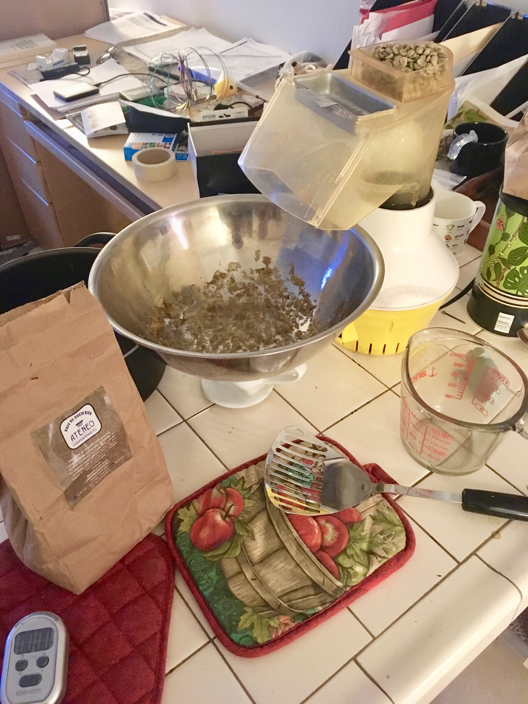
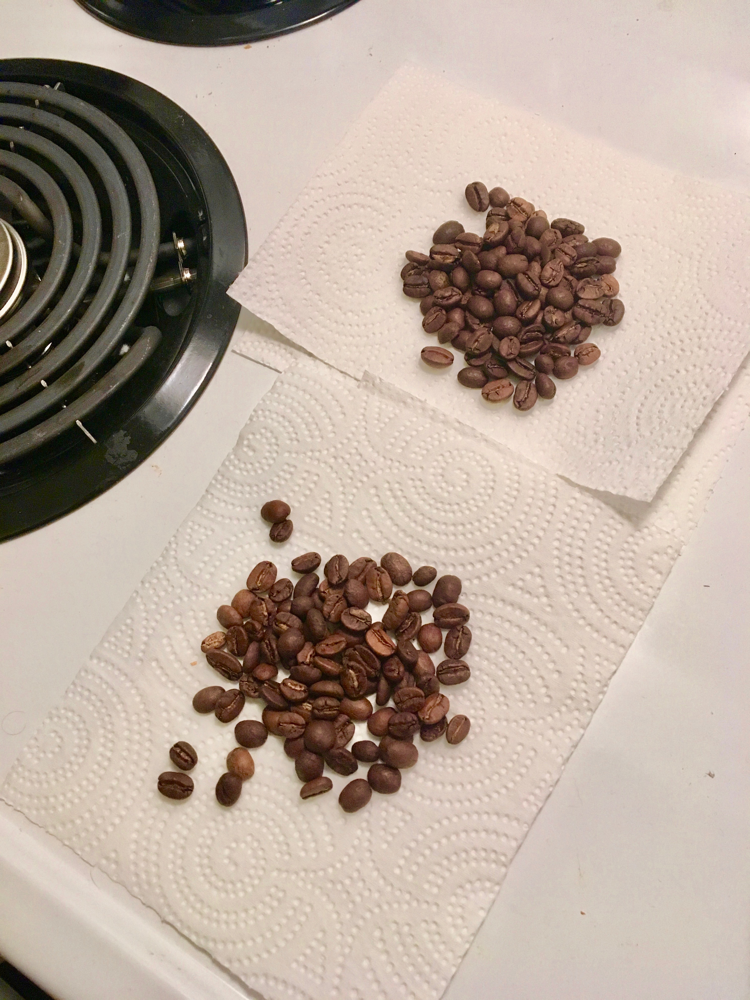

## Roasting coffee beans at home

Items
+ An air popcorn popper. Ideally, use a model that agitates the kernels as it blows hot air through them
+ Oven mitts
+ A co

1. Put into the popper an equal amount of coffee beans as popcorn kernels
2. Attach the full butter dish/popcorn chute to the popper, and direct the output into a large bowl filled with water
+ Put a little bit of water into the bowl in order to catch any chaff
+ Put the bowl on top of books or another platform---it should be as close as possible to the end of the chute
3. Turn on the popcorn popper. Within 30 seconds, chaff will start to collect in the bowl. At around 2 minutes, the "first crack" will become audible from many of the beans
4. Keep the popper running for about 4 minutes for a light roast, 5 minutes for a "full city" roast, and until a second crack is audible for a dark roast
5. Once desired time is reached, quickly remove the plastic chute (use oven mitts---everything will get hot) and then dump the hot beans into a metal bowl
6. Using a slotted spoon, mix the beans in the bowl until they are warm to the touch
7. Transfer to a jar, and leave open for 12 hours for CO2 to escape. The beans should develop a fresh roasted smell over that time

Roasting setup          |  Roasted beans
:-------------------------:|:-------------------------:
  |  
